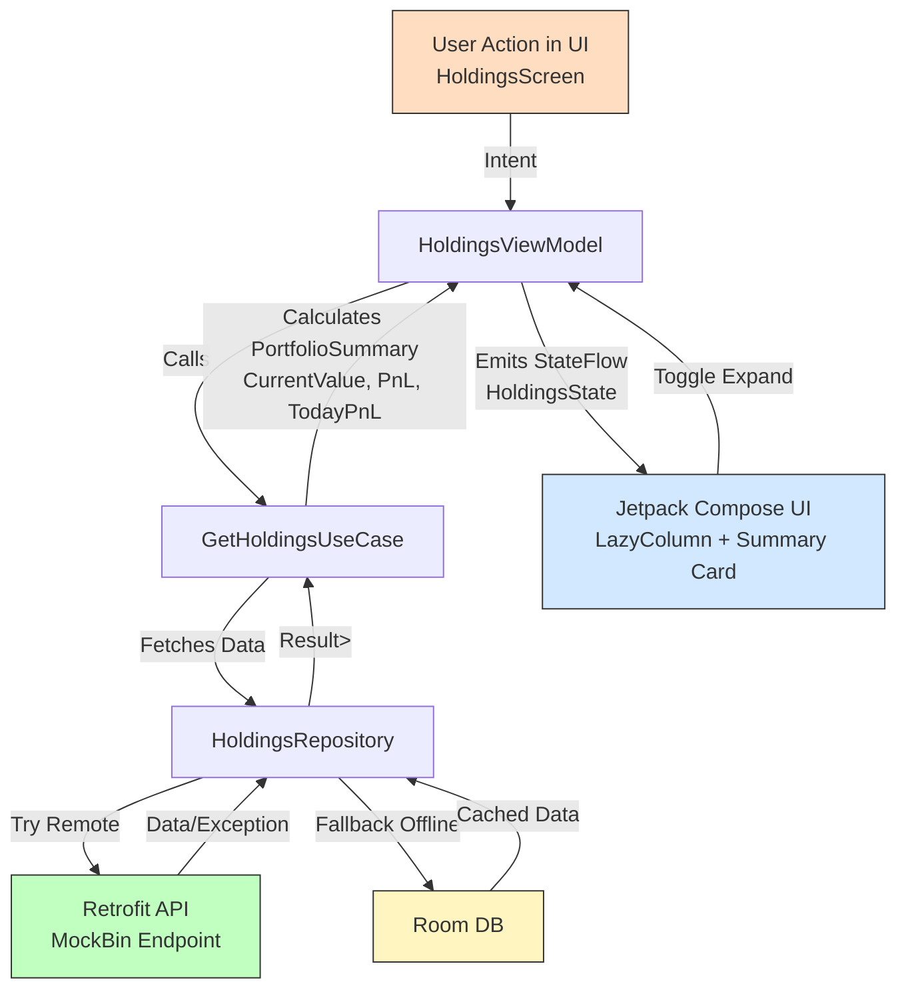

# Sujeet Stock App

A stock portfolio app demonstrating **MVI + Clean Architecture** using:

- **Jetpack Compose** for UI
- **Hilt** for Dependency Injection
- **Coroutines + Flow** for async data
- **Retrofit + Room** for networking and offline caching
- **Sealed Result** for Success/Error handling

---

## **High-Level Design (HLD)**

### **1. Architecture Overview**

The app follows **Clean Architecture + MVI (Model-View-Intent)**:

```
┌──────────────────────────┐
│        Presentation      │  ← Jetpack Compose + MVI
│ ┌──────────────────────┐ │
│ │ ViewModel (Reducer)  │ │
│ └──────────────────────┘ │
└─────────────▲────────────┘
              │ StateFlow
              ▼
┌──────────────────────────┐
│         Domain           │  ← Business Logic & Use Cases
│ ┌──────────────────────┐ │
│ │   UseCases           │ │
│ │   Entities           │ │
│ └──────────────────────┘ │
└─────────────▲────────────┘
              │ Repository Interface
              ▼
┌──────────────────────────┐
│          Data            │  ← Retrofit + Room
│ ┌──────────┐  ┌─────────┐│
│ │  Remote  │  │  Local  ││
│ │ Retrofit │  │  Room   ││
│ └──────────┘  └─────────┘│
└──────────────────────────┘
```

- **Presentation Layer (MVI)**  
  - `HoldingsScreen.kt` → Composable UI  
  - `HoldingsViewModel.kt` → Handles Intents & emits State  
  - **StateFlow** → Drives UI updates  

- **Domain Layer**  
  - `GetHoldingsUseCase.kt` → Business logic for calculating Portfolio Summary  
  - Pure Kotlin, no Android dependencies  

- **Data Layer**  
  - `HoldingsRepositoryImpl.kt` → Fetches from API (Retrofit), caches in Room  
  - Falls back to offline data on error  

---

### **2. Key Features**

- Portfolio with **Holdings & Positions tabs**  
- **Expandable/Collapsible bottom summary card** with slide animation  
- **PnL in Red/Green**  
- **Offline caching** using Room  
- **Sealed Result** for safe error handling  
- **Unit Test ready** for `GetHoldingsUseCase`  

---

## **Low-Level Design (LLD)**

### **1. Data Flow**

```
User Opens App
      │
      ▼
BottomNav -> Portfolio Tab (HoldingsScreen)
      │
      ▼
ViewModel emits LoadHoldings Intent
      │
      ▼
GetHoldingsUseCase -> Repository
      │
      ├─► Try Remote API (Retrofit)
      │        │
      │        └─► Save to Room
      │
      └─► On Failure → Load from Room
      │
      ▼
Compute Summary (CurrentValue, TotalInvestment, PnL)
      │
      ▼
Emit HoldingsState → Jetpack Compose UI renders
```

---

### **2. Key Classes & Responsibilities**

#### **Presentation Layer**
- **HoldingsViewModel**  
  - Handles MVI Intents (`LoadHoldings`, `ToggleSummary`)  
  - Emits `HoldingsState` with `StateFlow`  
- **HoldingsScreen**  
  - Observes StateFlow  
  - LazyColumn for holdings  
  - Expandable Bottom Card  

#### **Domain Layer**
- **Holding / PortfolioSummary**  
  - Entities used across the app  
- **GetHoldingsUseCase**  
  - Calculates: Current Value, Total Investment, Total PnL, Today’s PnL  

#### **Data Layer**
- **HoldingsRepositoryImpl**  
  - Fetches data from Retrofit API  
  - Caches to Room (Offline Support)  
  - Returns `Result<List<Holding>>`  
- **HoldingsDao / HoldingsDatabase**  
  - Local cache for holdings  

---

### **3. MVI State Example**

```kotlin
data class HoldingsState(
    val isLoading: Boolean = false,
    val holdings: List<Holding> = emptyList(),
    val summary: PortfolioSummary? = null,
    val error: String? = null,
    val isExpanded: Boolean = false
)
```

---

### **4. Project Structure**

```
com.upstox.android.sujeet.stockapp
│
├── data
│   ├── remote (Retrofit API)
│   ├── local (Room Entities, DAO)
│   └── repository (HoldingsRepositoryImpl)
│
├── domain
│   ├── model (Holding, PortfolioSummary)
│   ├── repository (Interface)
│   └── usecase (GetHoldingsUseCase)
│
├── presentation
│   └── holdings (MVI: State, Intent, ViewModel, Composables)
│   └── watchlist 
│   └── orders 
│   └── funds 
│   └── invest 
│   └── components (for all re-usable components)
│   └── routes (AppNavigation, BottomNavigation)
│
├── di (Hilt Modules)
├── utils (Sealed Result)
└── MainActivity + StockApp
```

---

### **5. Unit Testing**

- **GetHoldingsUseCaseTest**  
  - Verifies PnL calculations  
  - Verifies Result.Success & Result.Error scenarios  
- **Uses**: JUnit4 + MockK + Coroutines Test

---

### **6. Tech Stack**

- **Language**: Kotlin (2.0.21)  
- **UI**: Jetpack Compose + Material 3  
- **Architecture**: MVI + Clean  
- **Async**: Kotlin Coroutines + Flow  
- **Network**: Retrofit + Moshi  
- **DI**: Hilt  
- **Database**: Room  
- **Testing**: JUnit + MockK + Coroutine Test  

---

### **7. How to Run**

1. Clone the repository  
2. Open in **Android Studio Ladybug+**  
3. Sync Gradle  
4. Run the app on Android 21+  

---

## **8. Data Flow Diagram (DFD)**



---

## **9. App Screenshots**

### Splash Screen


### Holdings Screen (Collapsed Summary)


### Holdings Screen (Expanded Summary)


---

